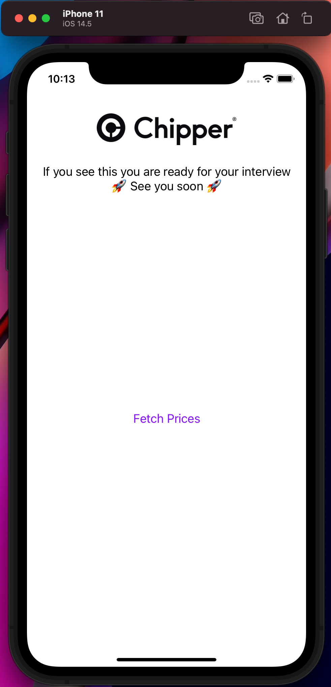

# Chipper Frontend Exercise
Welcome to the Chipper Frontend Exercise, please setup this
repo so that you can boot the application in a simulator ready for local development in your interview.

> There is no expectation to poke around in the code in this repo before your interview, but feel free to. 

Once you see the below screen please let your recruiter know you're ready for the interview.

# Set Up

1. Follow the React Native [setup](https://reactnative.dev/docs/environment-setup) guide for your machine. 
2. `yarn install`
3. `yarn ios` or `yarn android`
